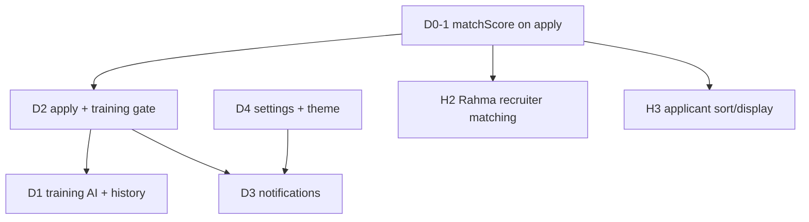

# David — Execution Plan (Agent Sessions)

**Owner:** David  
**Read first:** [AGENTS.md](../AGENTS.md) → [FEATURE_GUIDE.md](./FEATURE_GUIDE.md) → this file  
**Log work in:** [FEATURE_TRACKER.md](./FEATURE_TRACKER.md)

This plan orders work by **dependency and impact**. Many D2 items already exist—do not rebuild; extend and fix gaps.

---

## Session start checklist

```
[ ] NO GIT — agents never run git commands (humans pull/commit)
[ ] flutter pub get
[ ] secrets.dart + firebase_options.dart present
[ ] Read "Current focus" below
[ ] Read last Handoff in FEATURE_TRACKER.md
[ ] flutter run -d chrome
```

---

## Current focus

| Priority | ID | Task | Status |
|----------|-----|------|--------|
| **P0** | D0-1 | Persist `matchScore` on apply | ✅ |
| P1 | D2-polish | Apply flow gaps (see below) | ✅ |
| **P2** | **D1** | Train-before-apply module | ✅ |
| **P3** | **D3** | Notifications system | 🟡 inbox + FCM client; Function = phase 2 |
| P4 | D4 | Settings + dark mode | ✅ |

**Update this table** when you finish a slice.

---

## Why this order



| Order | Impact | Reason |
|-------|--------|--------|
| **D0-1** | **High** | Unblocks Rahma’s applicant sorting, analytics avg match, recruiter badges |
| D2 polish | High | Training gate belongs on apply path; avoid duplicate apply logic |
| D1 | Medium | New product value; depends on stable apply + CV |
| D3 | Medium | Local notifications exist; FCM + in-app list is large—split slices |
| D4 | Lower | UX polish; dark theme already defined |

---

## P0 — D0-1: Persist match score on apply

**Status:** ✅ Done (2026-06-04)  
**Unblocks:** H2, H3, H4 analytics accuracy

### Problem

`ApplicationRepository.apply()` creates applications **without** `matchScore`. Recruiter `sortedApplicantsProvider` and analytics average cannot work.

### Implementation

1. In `ApplyNotifier.apply()` (`application_providers.dart`):
   - If `cvStreamProvider` has CV, call `JobMatchingService.calculateMatch(cv, job)` (fetch job via `jobRepositoryProvider`).
   - Fallback: `AiService` quick score if embeddings fail (optional).
2. Extend `ApplicationRepository.apply()` to accept optional `int? matchScore` and write to `toMap()`.
3. Manual test: apply → Firestore doc has `matchScore` → recruiter job applicants list order changes.

### Acceptance criteria

- [x] New applications have `matchScore` 0–100 when candidate has CV
- [x] Apply still works when CV missing (`matchScore` null)
- [x] No duplicate apply regression (unchanged repo guard)
- [x] Tracker: D0, D2 updated

### Challenges log

| Date | Issue | Fix |
|------|-------|-----|
| — | — | — |

---

## P1 — D2: Apply flow + recruiter status (polish, not greenfield)

**Status:** ✅ — **do not reimplement from scratch**

### Already shipped (verify only)

| Item | Location |
|------|----------|
| Apply button + confirm | `job_detail_screen.dart` |
| Firestore application | `application_repository.dart` |
| States enum | `application_model.dart` |
| Recruiter shortlist/reject/accept | `applicant_detail_screen.dart`, `job_applicants_screen.dart` |
| Candidate list + tabs | `applications_screen.dart` |
| Status badges | `application_status_badge.dart` |
| Withdraw | `withdrawNotifierProvider` → `status: withdrawn` |
| Timeline UI | `application_detail_screen.dart` |

### David slices remaining

| Slice | Work | Files |
|-------|------|-------|
| D2-a | **Done with D0-1** if only matchScore was missing | — |
| D2-b | Align withdraw spec: delete vs `status: withdrawn` (see recommendations) | `application_repository.dart`, model |
| D2-c | Ensure timeline updates when `updatedAt` changes on recruiter action | repo + detail screen |

### Acceptance criteria (remaining)

- [x] Recruiter status change sets `updatedAt`
- [x] Timeline reflects shortlisted/accepted/rejected dates via `updatedAt`
- [x] Withdraw sets `status: withdrawn` (documented in tracker)

### Challenges log

| Date | Issue | Fix |
|------|-------|-----|
| — | — | — |

---

## P2 — D1: AI training module (“Train Before Apply”)

**Status:** ✅ Done (2026-06-04)  
**Note:** Distinct from `InterviewTrainingScreen` (dashboard practice).

### Recommended task split (improved from original 11 bullets)

| Slice | Deliverable |
|-------|-------------|
| D1-1 | Model + Firestore `training_sessions` + repository |
| D1-2 | Gemini: generate 5 job-specific questions (`AiService` method) |
| D1-3 | UI sheet on job detail: questions + answers + progress |
| D1-4 | Evaluate answers → readiness score 0–100 |
| D1-5 | Gate: disable Apply if score &lt; 60 OR show confirm dialog |
| D1-6 | Retry + list past sessions on application detail (optional) |

### Suggested Firestore schema

```
users/{uid}/training_sessions/{sessionId}
  jobId, jobTitle, questions[], answers[], readinessScore, createdAt
```

Alternative: subcollection under `applications/{id}` after apply — **worse for gating before apply**; prefer pre-apply sessions keyed by `jobId`.

### UX recommendation

- Button on `job_detail_screen`: **“Train Before Apply”** (use `AppStrings.trainBeforeApply`).
- Reuse `AiService` patterns from `interview_training_screen.dart` — don’t fork HTTP logic.
- **Do not** block apply globally without CV—only gate when user started training or team agrees always-on.

### Acceptance criteria

- [x] 5 questions generated for specific job
- [x] Per-question feedback after submit
- [x] Readiness score shown
- [x] Apply blocked when completed training &lt; 60%
- [x] Session saved to Firestore
- [x] Retry creates new session

### Challenges log

| Date | Issue | Fix |
|------|-------|-----|
| — | — | — |

---

## P3 — D3: Notifications system

**Status:** 🟡 Inbox MVP ✅; FCM client ✅; Cloud Function push = phase 2 ([FCM_CLOUD_FUNCTION.md](./FCM_CLOUD_FUNCTION.md))

### Already exists (extend only)

| Piece | File | Today |
|-------|------|-------|
| Local status toast | `local_notification_service.dart` | OS alert when status changes (app open) |
| FCM stub | `notification_service.dart` | Token only — no send pipeline |
| Profile tile | `profile_screen.dart` | Notifications → empty `onTap` |

Add Firestore inbox + screen; keep local alerts. **Tests:** [TEST_CASES.md](./TEST_CASES.md) TC-N1–N4.

### Two-layer model (read this before coding)

```
Layer A — In-app inbox (build first, D3-1…D3-5)
  Firestore users/{uid}/notifications/{id}
  → list screen, unread count, mark read, delete
  → written when events happen (client-side in v1)

Layer B — Push / FCM (build later, D3-6)
  Device token on users/{uid}.fcmToken
  → Firebase Cloud Function on Firestore trigger → FCM send
  → App cannot securely send push to other users from client alone
```

**Why in-app first:** Delivers 80% of UX (history, badge, read state) without backend. Works on web + mobile. Testable in one session.

**Why FCM is second:** True push when app is **killed** requires a trusted server (Cloud Function) reacting to `applications` or `notifications` writes. `firebase_messaging` in the app only **receives**; something else must **send**.

### Recommended slices

| Slice | Deliverable | Test case |
|-------|-------------|-----------|
| D3-1 | `NotificationModel` + repo | Manual doc in Console → visible to stream |
| D3-2 | Notify candidate on status change | **TC-N2** |
| D3-2b | Notify recruiter on new apply | **TC-N1** |
| D3-3 | `NotificationsScreen` + route | TC-N1/N2 list UI |
| D3-4 | Unread badge | **TC-N3** |
| D3-5 | Mark read + delete | **TC-N3** |
| D3-6 | FCM token + Function doc | TC-N1 with app killed (phase 2) |

### Improved scope vs original task list

| Original | Recommendation |
|----------|----------------|
| Push on status change | **v1:** Firestore inbox + keep local banner; **v2:** Function sends FCM using same event |
| Push on new job match | **Defer** — needs batch job matching all users. Replace with **recruiter: new applicant** (D3-2b) |
| In-app screen + badge + read/delete | **D3-1–D3-5** — primary MVP |
| FCM setup | **D3-6** — token + docs; full push = Function |

### Suggested `notifications` document

```json
{
  "id": "auto",
  "type": "application_status | new_application",
  "title": "Short headline",
  "body": "Detail text",
  "read": false,
  "createdAt": "Timestamp",
  "relatedId": "applicationId or jobId"
}
```

### Acceptance criteria (mapped to 8 original tasks)

- [ ] 1. FCM initialized; token saved on user doc (D3-6)
- [ ] 2. Permission requested on startup or settings (D3-6)
- [ ] 3. Status change → in-app notification (D3-2); push when Function deployed
- [ ] 4. New application → recruiter in-app notification (D3-2b) — *replaces “new job match” push*
- [ ] 5. In-app notifications screen (D3-3)
- [ ] 6. Unread badge (D3-4)
- [ ] 7. Mark read/unread (D3-5)
- [ ] 8. Delete notification (D3-5)
- [ ] TEST_CASES.md TC-N* pass; tracker updated

### Challenges log

| Date | Issue | Fix |
|------|-------|-----|
| 2026-06-05 | Web has no FCM token | Skip sync on `kIsWeb`; inbox still works |
| 2026-06-05 | Push when app killed needs server | [FCM_CLOUD_FUNCTION.md](./FCM_CLOUD_FUNCTION.md) |

---

## P4 — D4: Settings + dark mode

**Status:** ✅

### Slices

| Slice | Deliverable |
|-------|-------------|
| D4-1 | `settingsProvider` (SharedPreferences): `themeMode`, `notificationsEnabled` |
| D4-2 | `SettingsScreen` + `AppRoutes.settings` |
| D4-3 | `main.dart` `themeMode` from provider (Riverpod requires `ProviderScope` + override or `Consumer` wrapper) |
| D4-4 | About / Help / Privacy / Terms (static content or `url_launcher`) |
| D4-5 | Wire profile menu tiles (currently empty `onTap`) |

### Acceptance criteria (all 8 original tasks)

- [x] 1. Settings screen exists and navigates from Profile
- [x] 2. Dark mode toggle on settings
- [x] 3. Theme persists via SharedPreferences after restart
- [x] 4. Notification preferences toggle stored (gates local + FCM)
- [x] 5. About app screen/section
- [x] 6. Help/FAQ screen/section
- [x] 7. Privacy policy link opens
- [x] 8. Terms of service link opens

### Challenges log

| Date | Issue | Fix |
|------|-------|-----|
| — | — | — |

---

## David — full original checklist (36 tasks)

Use [FEATURE_TRACKER.md](./FEATURE_TRACKER.md) for live ✅/⬜ status.

### D1 — AI training module (11)

| # | Task |
|---|------|
| 1 | Add "Train Before Apply" button |
| 2 | Generate 5 questions via Gemini API |
| 3 | Build question display UI |
| 4 | Add progress indicator |
| 5 | Build answer input field |
| 6 | Send answer to AI for evaluation |
| 7 | Display detailed feedback per question |
| 8 | Calculate readiness score |
| 9 | Block apply if score &lt; 60% |
| 10 | Allow retry training |
| 11 | Save training history to Firestore |

### D2 — Apply flow + accept/reject (9) + D0-1

| # | Task |
|---|------|
| — | **D0-1:** Persist `matchScore` on apply (prerequisite) |
| 1 | Add "Apply" button on job details |
| 2 | Create application in Firestore |
| 3 | Define application states (pending/shortlisted/accepted/rejected) |
| 4 | Build recruiter accept/reject buttons |
| 5 | Update status in Firestore |
| 6 | Build application history screen (Candidate) |
| 7 | Add status badges with colors |
| 8 | Add withdraw application feature |
| 9 | Build application timeline view |

### D3 — Notifications — FCM (8)

| # | Task | Plan note |
|---|------|-----------|
| 1 | Setup Firebase Cloud Messaging | D3-6 |
| 2 | Request notification permissions | D3-6 + local init |
| 3 | Send push on status change | In-app v1 (D3-2); FCM phase 2 |
| 4 | Send push on new job match | **→** recruiter: new application (D3-2b) |
| 5 | Build in-app notification screen | D3-3 |
| 6 | Add notification badge with unread count | D3-4 |
| 7 | Implement mark as read/unread | D3-5 |
| 8 | Add delete notification feature | D3-5 |

### D4 — Settings + dark mode (8)

| # | Task |
|---|------|
| 1 | Build settings screen |
| 2 | Add dark mode toggle |
| 3 | Save dark mode to SharedPreferences |
| 4 | Add notification preferences |
| 5 | Build About app screen |
| 6 | Build Help/FAQ screen |
| 7 | Add privacy policy link |
| 8 | Add terms of service link |

---

## Original task list → plan mapping

### 1. AI training module (original 11 items)

| # | Original | Plan ID | Notes |
|---|----------|---------|-------|
| 1 | Train Before Apply button | D1-3 | Job detail, not dashboard |
| 2–6 | Questions UI, progress, input | D1-3 | Single training sheet |
| 7–8 | AI evaluation + feedback | D1-4 | Extend `AiService` |
| 9 | Readiness score | D1-4 | |
| 10 | Block apply &lt; 60% | D1-5 | After D0-1 |
| 11 | Retry + Firestore history | D1-1, D1-6 | |

### 2. Apply flow + accept/reject (original 9 items)

| # | Original | Status |
|---|----------|--------|
| 1–3 | Apply + states | ✅ verify |
| 4–5 | Recruiter buttons + Firestore | ✅ verify |
| 6–9 | History, badges, withdraw, timeline | ✅ / polish D2-b,c |
| — | **matchScore** | **D0-1** (added) |

### 3. Notifications (original 8 items)

| # | Original | Plan ID |
|---|----------|---------|
| 1–3 | FCM setup + push | D3-6 (+ Functions doc) |
| 4–8 | In-app UI + badge + read/delete | D3-1–D3-5 |
| — | Push on new match | **Deferred** (see above) |

### 4. Settings + dark mode (original 8 items)

| # | Original | Plan ID |
|---|----------|---------|
| 1–3 | Settings + dark + prefs | D4-1–D4-3 |
| 4 | Notification prefs | D4-1 (consume in D3) |
| 5–8 | About, Help, legal links | D4-4 |

---

## Task improvements (adopted suggestions)

1. **Merge D0-1 into apply ownership** — Rahma’s matching UI is done; persist `matchScore` when the candidate applies.
2. **Rename clearly in UI** — **“Train Before Apply”** (job-specific, on job detail) vs **“Interview Practice”** (dashboard `interview_training_screen`) — different strings, icons, routes.
3. **Withdraw semantics** — Spec says withdraw; code **deletes** the application doc. Prefer `ApplicationStatus.withdrawn` (or `status: withdrawn`) + filter out of recruiter lists if you need an audit trail.
4. **Notifications (two phases)** — See [P3 expanded section](#p3--d3-notifications-system): **in-app Firestore inbox first** (list, badge, read/delete, write on status/applicant events); **FCM + Cloud Function second** for push when app is closed. Do not block inbox on FCM.
5. **“Push on new job match”** — Defer. Replace with **recruiter notification when a new application arrives**; optional later: in-app “high match jobs” when user opens Jobs tab (no background push).

---

## Example agent prompt (new session)

Copy, fill brackets, paste at start of chat:

```text
You are working on the JobScope Flutter project.

Read in order:
1. AGENTS.md (mandatory rules: NO GIT, do not break other features)
2. docs/FEATURE_TRACKER.md (status + last handoff for [D0-1 | D1 | D2 | D3 | D4])
3. docs/FEATURE_GUIDE.md (do-not-redo table if relevant; implementation order)
4. docs/DAVID_PLAN.md (current focus table)
5. docs/TEST_CASES.md (run matching TCs after slice)

Hard rules: never run git/gh; minimal diff; do not gut unrelated features to ship yours.

Task for this session:
- ID: [e.g. D0-1]
- Goal: [one sentence]
- Extend only — see FEATURE_GUIDE "Do not redo" + tracker ✅ rows

Implementation:
- One vertical slice; FEATURE_GUIDE §3 order
- After slice: flutter analyze + TEST_CASES.md cases for this ID
- Update FEATURE_TRACKER (log + handoff + test record)
- Update DAVID_PLAN "Current focus" when slice complete

If blocked, state blocker and smallest next step—do not expand scope.
```

**Example filled (D0-1):**

```text
Task: D0-1 — persist matchScore on apply. Extend applyNotifierProvider + application_repository only.
After: run TEST_CASES.md "D0-1" + TC-D0-1-E1. Tracker + DAVID_PLAN focus table.
```

**Example filled (D3-2b):**

```text
Task: D3-2b — write notification doc for recruiter when candidate applies.
Demo: TEST_CASES.md TC-N1 (R posts "Backend Demo", C applies, R sees inbox + Firestore).
```

---

## Definition of done (David milestone)

- [x] D0-1 complete + verified in Firestore
- [x] Train-before-apply MVP on job detail
- [ ] In-app notifications MVP
- [ ] Settings + dark mode wired
- [ ] All slices logged in FEATURE_TRACKER
- [ ] No new `flutter analyze` errors in touched files

---

## Handoff block (copy when ending session)

```markdown
### Handoff — YYYY-MM-DD

**Finished:**
**Next:**
**Blockers:**
**Tested:**
**Tracker IDs updated:**
```
